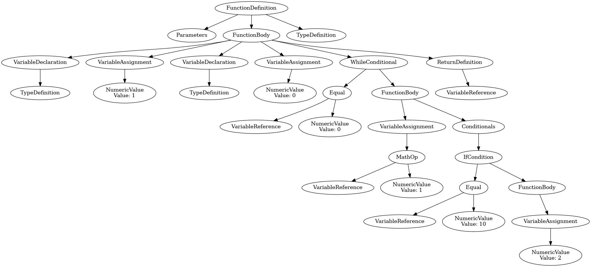

# Status
Best way to see what kind of program we can compile is to look at the [reference](./reference) programs we used for the tests. 

That said
- We support control flow with conditionals and loops.
- Single pointers, but not too fancy double pointers.
- Function calls and function definitions.
- Few syscall (write and brk).
- Few datatype's - mainly int, but with some struct support also. In addition to these pointer variants.


## Debug utils
View the generated ast

```bash
python3 -m baby_compiler.plot_ast "./reference/control_flow/while_loops_without_else.c"
```



## Todo

### Floating points
- https://en.wikibooks.org/wiki/X86_Assembly/Floating_Point
- https://cs.fit.edu/~mmahoney/cse3101/float.html
- https://students.mimuw.edu.pl/~zbyszek/asm/en/slides/float.pdf

