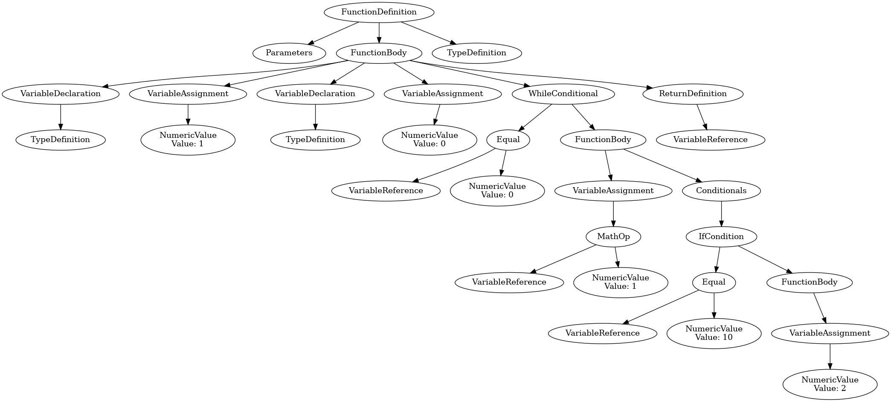

# C compiler and a tiny libc

Project I started on before Christmas 2023, might return to it or skip to next level ... 

It's one of the chapters for [From the Transistor to the Web Browser](https://github.com/geohot/fromthetransistor), namely the compiler chapter. I did it in Python instead of Haskell. If you prefer more exocit languages, see this [project](https://github.com/2xic/tiny-evm-language) I did.

| Sub-project                          | Status                           |
| ------------------------------------ | -------------------------------- |
| [The C compiler](./baby-c-compiler/) | Can run basic programs           |
| [The linker](./basic-linker/)        | Skipped it                       |
| [The baby libc](.//baby-libc/)       | You only get malloc ... for now. |

## Ast example

